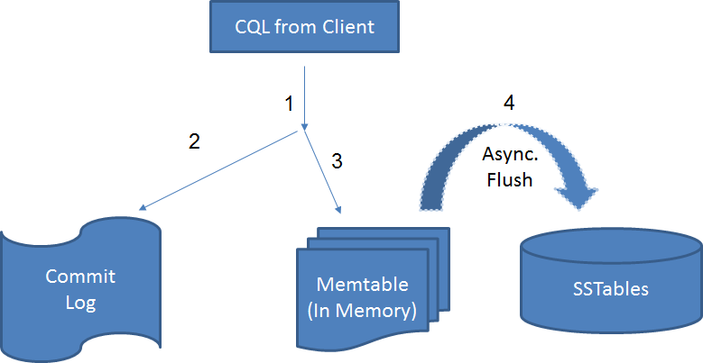

# Cassandra Architecture & Replication Factor Strategy Tutorial

Cassandra stores data on different nodes with a peer to peer distributed fashion architecture.

All the nodes exchange information with each other using Gossip protocol. Gossip is a protocol in Cassandra by which nodes can communicate with each other.

# Components of Cassandra


- **Node**, where data is stored

- **Data Center**, Collection of nodes

- **Cluster**, collection of datacenters

- **Commit Log**, write operation is written to Commit Log. Commit log is used for crash recovery.

- **Mem-table**, data written in Commit log is written in Mem-table temporarily.

- SSTable, When Mem-table reaches a certain threshold, data is flushed to an SSTable disk file.

# Life cycle of the data

CommitLog, MemTable, and SSTable are 3 core components of cassandra.

High level life cycle of the data from the time it is written from a cassandra client to the time it is persisted to SSTables



**Step 1** Request is received by a random node in the cluster.

**Step 2** Node Writes data into the local commit log file in a sequential manner.

**Step 3** Memtable gets updated in asynchronous mode.

**Step 4** Memtable flushes the data to SSTables periodically, SStables is really the final persistance store for the data.

**Step 5** Once data makes it way to SSTables the corresponding reference of the record in commit log and Memtable is flushed out.

# nodetool

- Used for maintenance, to ensure all pending transactions are flushed out to the SSTables before a node shutdown

- Explicitly flush the data in commit log or Mem-tableinto SSTable

# Testing Cassandra Durability

- Let us put cassandra's durability to test with a real world ecommerce use case.
- Let us assume we have a keyspace that manages user cart or orders and given a scenario of node failure let us put cassandra's durability to test.

- Load some sample data into cassandra and shutdown the databased before cassandra performs a flush to SSTables.

- Make sure cassandra server is running, start by using following command in the foreground

#### Connect to Cassandra using cql and execute the scripts

```bash
./bin/cqlsh.sh
```

OR

```bash
docker exec it <CONTAINER_NAME> bash
```

```bash
# create keyspace
CREATE KEYSPACE ecommerce WITH replication = {'class':'SimpleStrategy', 'replication_factor':1};

-- create table
CREATE TABLE ecommerce.orders (
           users_id INT,
           orders_id INT,
           order_status text,
           first_name text,
           last_name text,
           order_total float, 
           shipping_total float, 
           tax_total float, 
           promotions_total float,
           emails set<text>,
           order_log map<text, timestamp>,
           order_comments map<text, timestamp>,
           PRIMARY KEY(orders_id, users_id)
) WITH comment='Orders Table';

# insert sample data
INSERT INTO ecommerce.orders (users_id, orders_id, order_status, first_name, last_name, order_total, shipping_total, tax_total, promotions_total, emails,order_log,order_comments)
       VALUES(123, 321,'Pending' ,'hariharan','vadivelu',20.30,2.00,1.00,5.00,{'a@gmail.com', 'b@gmail.com'},{ 'created_on':'2013-06-13 11:42:12','last_updated':'2013-06-13 11:42:12'},{ 'comment_1':'2013-06-13 11:42:12','comment_2':'2013-06-13 11:42:12'});

INSERT INTO ecommerce.orders (users_id, orders_id, order_status, first_name, last_name, order_total, shipping_total, tax_total, promotions_total, emails,order_log,order_comments)
       VALUES(1234, 4321,'Pending' ,'hariharan','vadivelu',20.30,2.00,1.00,5.00,{'a@gmail.com', 'b@gmail.com'},{ 'created_on':'2013-06-13 11:42:12','last_updated':'2013-06-13 11:42:12'},{ 'comment_1':'2013-06-13 11:42:12','comment_2':'2013-06-13 11:42:12'});
```


Once the data is loaded you can exit cqlsh and check your data directory, the location of data directory is defined in ./config/cassandra.yaml files "data_file_directories" key property.


E..g if mapped to your home directory, go to ~/cassandra/data/ecommerce/orders and you should not notice any files in this directory, usually you will find a couple of files related to SSTables in this location once the flush operation is completed.

We can terminate cassandra at this point to replicate a situation where in cassandra data is not yet flused to SSTables and is only available with in the commit log and Memtables in memory data store.

Now you can bring up cassandra and you should notice few interesting log messages indicating a replay of pending records from commit log to SSTables.
Once this operation is complete check the ~/cassandra/data/ecommerce/orders folders and you should not see the data inserted before the server crash.

```md
Completed flushing /home/search/cassandra/data/system/compaction_history/system-compaction_history-jb-1-Data.db (237 bytes) for commitlog position ReplayPosition(segmentId=1395543674692, position=271)
```

You should be able to query the same from cqlsh as well.

```bash
select * from ecommerce.orders;
```

or you can also check the data in sstables using the ./bin/sstables utility

```bash
./sstable2json /home/search/cassandra/data/ecommerce/orders/ecommerce-orders-jb-1-Data.db
```
